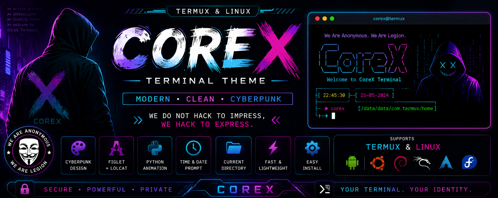

<p align="center">
  
</p>

<h1 align="center">
  
  <br>
  CoreX
  <br>
</h1>

<p align="center">
  <strong>A Modern, Clean & Cyberpunk Terminal Theme for Termux & Linux</strong>
</p>

<p align="center">
  
  
  
  
</p>

---

# ✨ Features

* 🎨 Modern cyberpunk terminal banner
* 🌈 Colorful `figlet` + `lolcat` logo
* 🐍 Python welcome animation
* ⌚ Beautiful prompt with Time, Date & Current Directory
* ⚡ Fast and lightweight
* 🔧 Easy installation
* ♻️ One-click uninstall
* 💾 Automatic backup & restore
* 📱 Designed for Termux
* 🐧 Supports Linux (Ubuntu, Debian, Kali, Arch & Fedora)

---

# 📦 Installation

## 📱 Termux

### 1. Update Termux

```bash
pkg update -y && pkg upgrade -y
```

### 2. Install Dependencies

```bash
pkg install -y git bash python python2 python3 \
figlet ruby curl nano clang fish php perl \
nmap w3m hydra cowsay tar host help

pip install requests mechanize lolcat bs4 futures rich
pip2 install requests mechanize bs4 futures
```

### 3. Clone Repository

```bash
git clone https://github.com/AmitDas4321/CoreX.git
```

### 4. Open Project

```bash
cd CoreX
```

### 5. Run Installer

```bash
chmod +x install.sh
./install.sh
```

### 6. Restart Shell (Optional)

```bash
exec bash
```

---

## 🐧 Linux Installation

### Ubuntu / Debian / Kali

Install required packages:

```bash
sudo apt update

sudo apt install -y \
git bash python3 figlet lolcat
```

Clone the repository:

```bash
git clone https://github.com/AmitDas4321/CoreX.git
```

Open the project:

```bash
cd CoreX
```

Run the installer:

```bash
chmod +x install.sh
./install.sh
```

---

### Arch Linux

Install required packages:

```bash
sudo pacman -S git bash python figlet lolcat
```

Clone the repository:

```bash
git clone https://github.com/AmitDas4321/CoreX.git
```

Open the project:

```bash
cd CoreX
```

Run the installer:

```bash
chmod +x install.sh
./install.sh
```

---

### Fedora

Install required packages:

```bash
sudo dnf install git bash python3 figlet lolcat
```

Clone the repository:

```bash
git clone https://github.com/AmitDas4321/CoreX.git
```

Open the project:

```bash
cd CoreX
```

Run the installer:

```bash
chmod +x install.sh
./install.sh
```

---

# 🗑️ Uninstall

```bash
cd CoreX

chmod +x uninstall.sh

./uninstall.sh
```

---

# 📁 Project Structure

```text
CoreX/
├── install.sh
├── uninstall.sh
├── bash.bashrc
├── wlc.py
├── LICENSE
├── banner.png
└── README.md
```

---

# 🌍 Supported Platforms

* ✅ Termux
* ✅ Ubuntu
* ✅ Debian
* ✅ Kali Linux
* ✅ Arch Linux
* ✅ Fedora

---

# 🎯 Requirements

### Termux

* Latest Termux
* Python
* Bash
* Figlet
* Lolcat
* Internet Connection

### Linux

* Bash
* Python 3
* Figlet
* Lolcat
* Git
* Internet Connection

---

# 👨‍💻 Author

<p align="center">
  <a href="https://github.com/AmitDas4321">
    
  </a>
</p>

<p align="center">
  <strong>Amit Das</strong><br>
  Full Stack Developer
</p>

<p align="center">
  <a href="https://github.com/AmitDas4321">
    
  </a>
</p>

---

# ⭐ Support

If you like this project, don't forget to leave a ⭐ on GitHub.

---

# 📜 License

This project is licensed under the **MIT License**.

---

<p align="center">
  <b>Made with ❤️ by <a href="https://amitdas.site">Amit Das</a></b><br>
  ☕ Support development: <a href="https://buymeacoffee.com/amitdas4321">Buy Me a Coffee</a>
</p>
